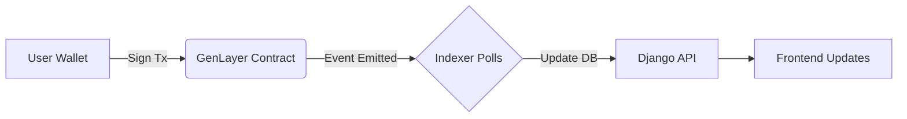
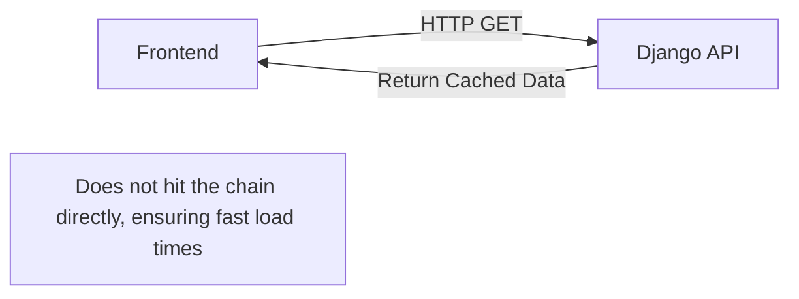

# Covenant Escrow

Covenant Escrow is an AI-native trust layer for decentralized grants and community funding. Instead of relying on manual committee reviews or fully optimistic systems, Covenant Escrow uses Intelligent Contracts on GenLayer to lock funds and release them only when an LLM mathematically verifies that a delivered milestone meets the originally agreed-upon criteria.

### 🌐 [Live Demo](https://covenant-escrow.vercel.app)

_Note: The live demo is currently running against GenLayer's **studionet**._

---

## How It Works

Covenant Escrow replaces the traditional "trust the grantee" or "wait for the committee" models with an autonomous, transparent flow:

1. **Propose:** A builder submits a grant proposal, detailing what they will build, how much funding they need, and the exact criteria that will prove the work is done.
2. **Fund:** The community votes using their governance tokens. If approved, the DAO's treasury automatically locks the requested funds in an escrow specific to that proposal.
3. **Deliver:** The builder completes the work and submits a link (e.g., a GitHub repo, a deployed app, or a document) as proof of delivery.
4. **Verify:** The Intelligent Contract reaches out to the provided URL, reads the content, and evaluates it against the original criteria using an LLM consensus mechanism.
5. **Release:** If the AI verification passes, the escrowed funds are instantly released to the builder. If it fails, the funds remain locked, and the builder can try again or the DAO can reclaim the funds after a timeout.

---

## The Trust Model

Covenant Escrow blends deterministic blockchain mechanics with probabilistic AI judgements. It is critical to understand the boundaries of what the system does and does not guarantee.

- **What is Cryptographically Enforced:** Escrow mechanics, token-weighted voting, timeout durations, and the actual movement of funds are strictly deterministic and enforced on-chain.
- **What is AI-Judged:** The screening of initial proposals (for spam/relevance) and the verification of final deliverables are judged by LLMs via GenLayer's consensus mechanism.

**The Limitation of AI Verification:**
The AI verification process judges whether the **fetched page content** appears to satisfy the written deliverable criteria. It does not and cannot cryptographically prove that the underlying work was genuinely performed, is secure, or hasn't been fabricated. A sufficiently motivated bad actor could create a convincing landing page or README that passes the text-based criteria without having actually built the software.

**The Safety Net:**
The true security of Covenant Escrow lies in the DAO governance process. DAO members see and approve the exact deliverable criteria _before_ voting to lock funds behind them. Weak, vague, or easily gameable criteria are a failure of the DAO's voting process, not a gap in the escrow mechanism. This is a deliberate design tradeoff: by relying on the community to demand rigorous, easily verifiable criteria upfront, the system enables fully autonomous payouts on the back end.

---

## Key Features

- **Multi-DAO Support:** Any community can spin up its own DAO with independent rules, token weights, and voting parameters.
- **AI-Screened Proposals:** Automated first-pass filters to reject spam or off-topic proposals before they reach voters.
- **Token-Weighted Voting:** Standard ERC20-style governance voting to approve or reject grants.
- **Escrow with Automatic Release:** Funds are locked in the contract and only move when cryptographically or AI-verified conditions are met.
- **AI-Verified Milestone Delivery:** Payouts triggered automatically based on LLM consensus over delivered URLs.
- **Automatic Fund-Reclaim Protection:** If a delivery fails repeatedly or the builder abandons the project, the DAO can automatically reclaim the funds after a predefined timeout.
- **Full Audit Trail:** Every proposal, vote, delivery attempt, and AI judgment is immutably recorded per proposal.
- **Wallet-Based Auth (SIWE):** Secure Sign-In with Ethereum for all user actions.
- **Real-Time-Feeling UX:** Achieved via fast-path indexer syncs and optimistic frontend updates, bridging the gap between blockchain finality and web2 expectations.

---

## Architecture Overview

Covenant Escrow is built as a monorepo containing three distinct layers:

1. **Contract Layer:** The GenLayer Intelligent Contract written in Python (GenVM). It acts as the ultimate source of truth, holding funds, enforcing voting rules, and executing AI validations.
2. **Backend Layer:** A Django application that indexes the contract state into a PostgreSQL database for fast querying. It also serves as an API for social features (like comments) and user profiles that don't need to live on-chain.
3. **Frontend Layer:** A Next.js App Router application that provides the user interface, interacting with both the backend API for reads and the blockchain for writes.

### Data Flow

**Write Action (e.g., Voting):**



**Read Action (e.g., Viewing Proposals):**



---

## Tech Stack

| Layer        | Technologies Used                                                               |
| :----------- | :------------------------------------------------------------------------------ |
| **Contract** | Python, GenVM                                                                   |
| **Backend**  | Django 5.2, Django REST Framework, PostgreSQL, Redis, Celery                    |
| **Frontend** | Next.js 16.2, TypeScript, Tailwind CSS, wagmi/viem, genlayer-js, TanStack Query |

---

## Local Development Setup

To run the full stack locally, you'll need multiple terminal windows.

### 1. Contract (GenLayer Studio)

Install the `genlayer` CLI if you haven't already.

```bash
cd contract
genlayer up
```

This starts the local GenLayer simulator and deploys the contracts.

### 2. Backend (Django)

Ensure you have Python 3.12, PostgreSQL, and Redis installed and running.

```bash
cd backend
python -m venv env
source env/bin/activate
pip install -r requirements.txt

# Run migrations
python manage.py migrate

# Start the server
python manage.py runserver

# In separate terminals, start the Celery workers:
celery -A covenant_escrow_backend worker -l info
celery -A covenant_escrow_backend beat -l info
```

### 3. Frontend (Next.js)

Ensure you have Node.js installed.

```bash
cd frontend
npm install
npm run dev
```

The app will be available at `http://localhost:3000`.

---

## Project Structure

```text
covenant-escrow/
├── contract/       # GenLayer Intelligent Contracts and deployment scripts
├── backend/        # Django REST API, indexer, and Celery tasks
└── frontend/       # Next.js web application and UI components
```

---

## Known Limitations

- **No Treasury Withdrawal Path:** By design, deposits into a DAO's treasury are one-way. There is currently no mechanism to withdraw unallocated funds back to the original depositors.
- **Network Environment:** The application currently points to GenLayer's `studionet` as its production environment, rather than `testnet-Bradbury` or mainnet, due to the current phase of network rollout.
- **Wallet Support:** Wallet sign-in and transactions are currently optimized for and only support **MetaMask**. Other wallets may experience unexpected behavior during the SIWE flow or GenLayer transactions.

---

## License

This project is licensed under the GNU General Public License v3.0 (GPLv3) - see the [LICENSE](LICENSE) file for details.

## Links

- **Live Demo:** [https://covenant-escrow.vercel.app](https://covenant-escrow.vercel.app)
- **GitHub Repository:** [https://github.com/micoliser/covenant-escrow](https://github.com/micoliser/covenant-escrow)
- **GenLayer:** [https://genlayer.com](https://genlayer.com)
